# Architecture

This document contains the full Mermaid diagram set (Section 40 of the build
prompt) plus narrative explaining each. See [README.md](README.md) for the
top-level summary diagram.

## 1. Overall Platform

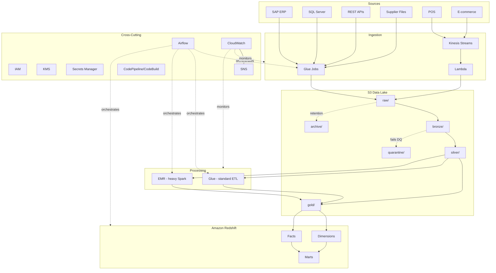

## 2. Batch Ingestion (SAP / SQL Server / API / Files)

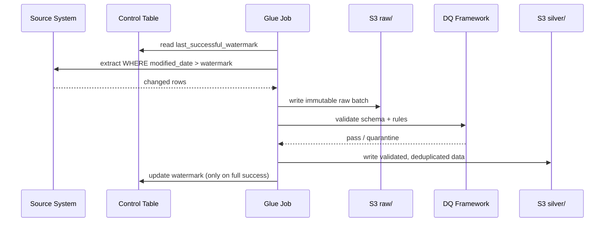

## 3. Incremental Ingestion (Watermark Lifecycle)

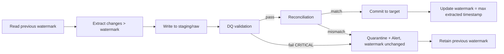

## 4. CDC Processing

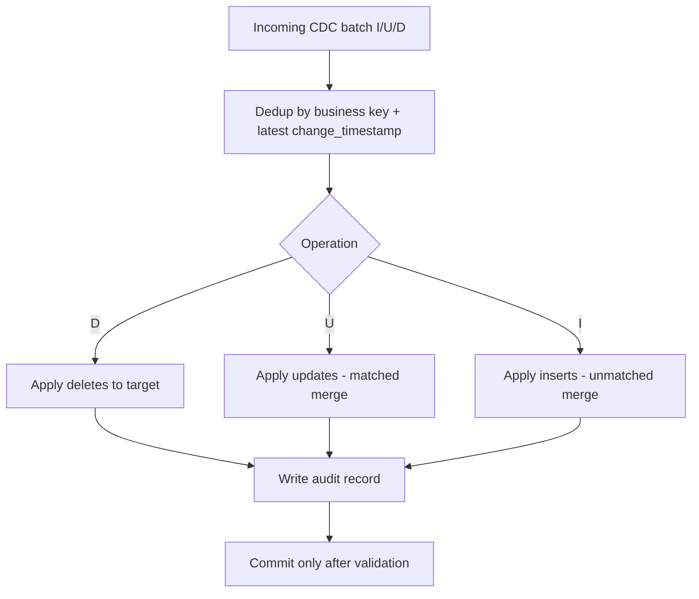

## 5. SCD Type 2 (dim_customer)

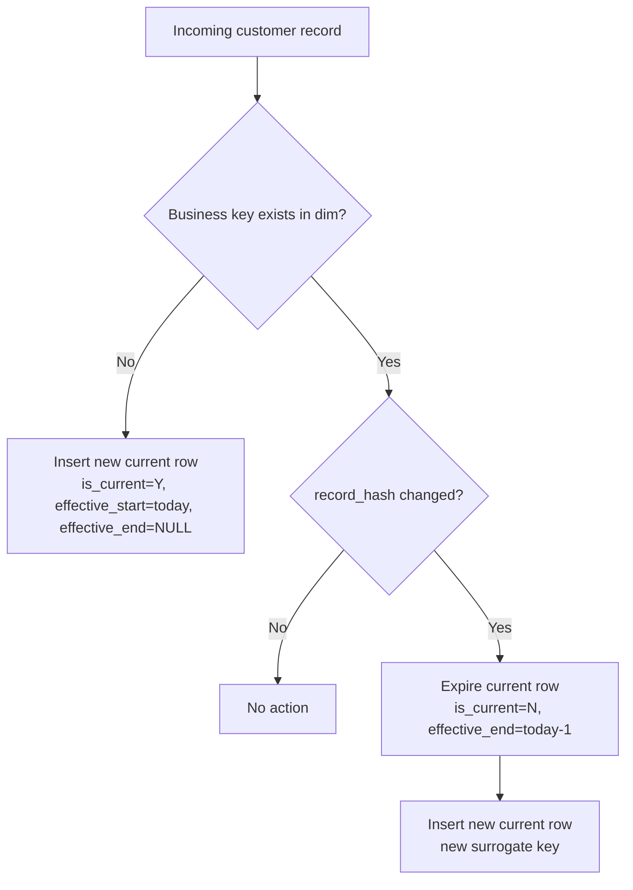

## 6. Streaming (POS / E-commerce)

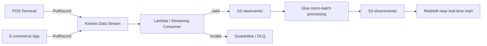

## 7. Airflow Orchestration

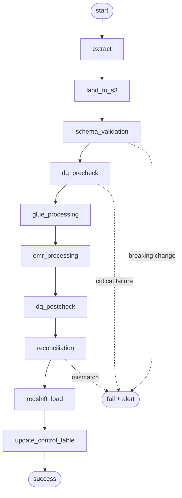

## 8. Failure / Retry Flow

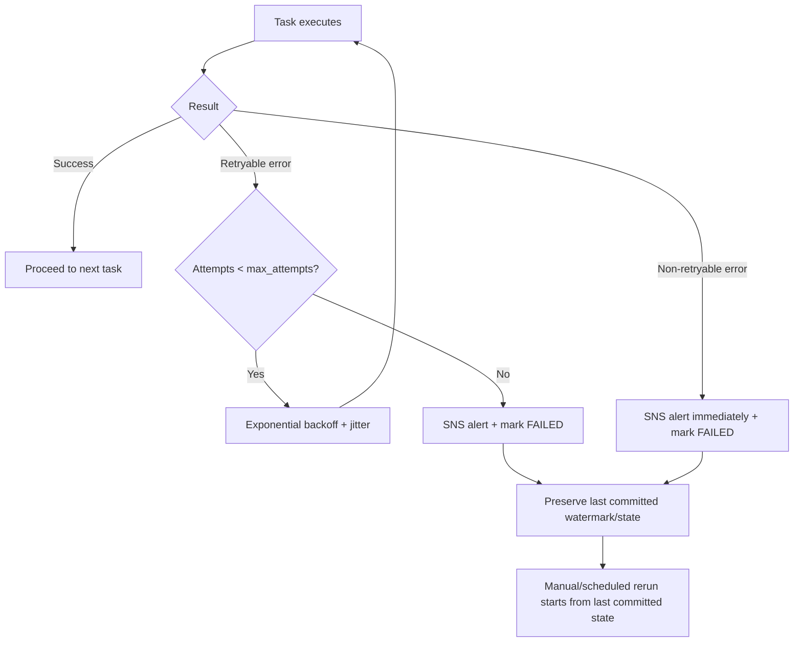

## 9. Data Quality Framework

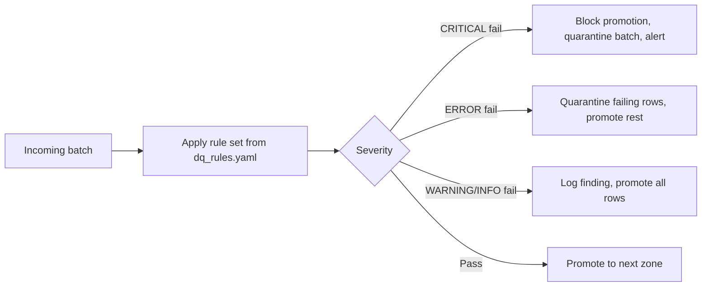

## 10. Reconciliation

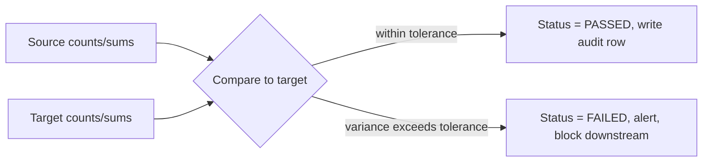

## 11. CI/CD

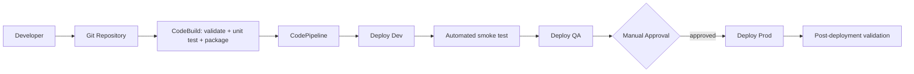

## 12. Security

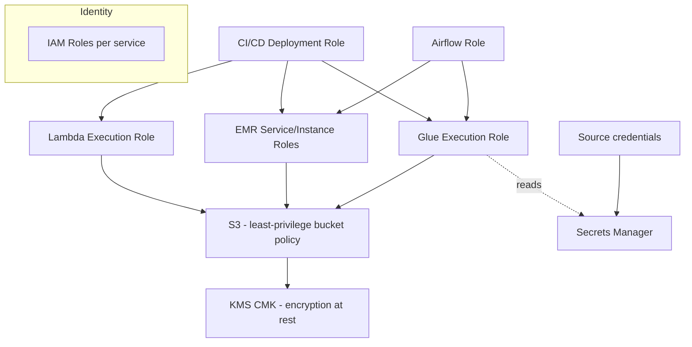

## 13. Dev/QA/Prod Promotion

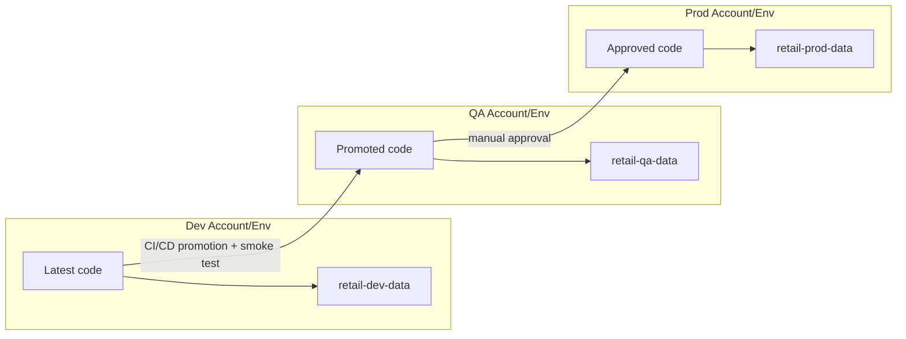

## Glue vs EMR vs Airflow — Explicit Responsibilities

| Concern | Glue | EMR | Airflow |
|---|---|---|---|
| Batch extraction from SAP/SQL Server/API | ✅ | — | triggers/monitors |
| Standard cleansing, schema validation | ✅ | — | triggers/monitors |
| Data Catalog / partition registration | ✅ | — | — |
| Complex multi-way joins, TB-scale aggregation | — | ✅ | triggers/monitors |
| Historical backfill | — | ✅ | triggers/monitors |
| Cross-job dependency management, scheduling, retries | — | — | ✅ |
| Executing Spark code | ✅ (Glue Spark) | ✅ (EMR Spark) | ❌ never |

See ADR-002 for the full Glue-vs-EMR decision rationale.
