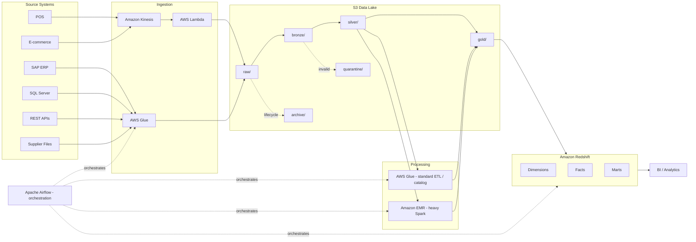

# RetailCo — AWS Retail Data Engineering Modernization Platform

A production-inspired, portfolio/interview-reference implementation of a retail data
platform on AWS. It demonstrates how a fictional omnichannel retailer, **RetailCo**,
modernizes a fragmented legacy data estate (SAP ERP, SQL Server, REST APIs, POS,
e-commerce events, supplier files) into a governed AWS data lake and analytical
warehouse using **Glue, EMR, Airflow, Lambda, Kinesis, S3, Redshift, IAM, KMS,
Secrets Manager, CloudWatch, SNS and AWS CI/CD**.

This repository is designed to be read end-to-end: architecture decisions, control
flow, failure handling, security, and cost trade-offs are documented alongside working
code. AWS-specific integrations use local adapters/mocks so the framework logic
(incremental ingestion, CDC, SCD2, merge/upsert, DQ, reconciliation, retry) can be
exercised without live AWS infrastructure.

> Scope note: this project is for learning, interview preparation, and architecture
> demonstration. It is not a deployed production system. Where AWS credentials or
> infrastructure are unavailable, local file-based / SQLite adapters stand in for
> S3, Redshift, and Secrets Manager so the logic remains runnable and testable.

---

## 1. Business Scenario

**RetailCo** operates physical stores, an e-commerce site/app, warehouse and
distribution operations, and a supplier network. Its legacy estate is fragmented:

| Source | System | Data |
|---|---|---|
| ERP | SAP | product master, vendor master, purchase orders, inventory, store master |
| OLTP | SQL Server | customers, orders, order items, stores, promotions |
| External | REST APIs | promotions, marketplace feeds, product enrichment, FX/reference data |
| Store | POS | near-real-time sales transactions |
| Digital | E-commerce | order created/updated, payment completed, cart activity, product viewed |
| Partners | Supplier files | product catalog, price lists, inventory feeds (CSV/JSON) |

See [PROJECT_OVERVIEW.md](PROJECT_OVERVIEW.md) for the full business narrative and
[docs/interview/project_story.md](docs/interview/project_story.md) for interview-ready
summaries at 30s/60s/2min/senior depth.

## 2. Architecture at a Glance



Full diagram set: [ARCHITECTURE.md](ARCHITECTURE.md).

## 3. AWS Service Mapping

| Service | Responsibility | Not used for |
|---|---|---|
| **S3** | Durable data lake (raw/bronze/silver/gold/quarantine/archive) | Query engine |
| **AWS Glue** | Managed batch ingestion, standard ETL, Data Catalog, schema/partition management | TB-scale complex joins, iterative ML-style Spark tuning |
| **Amazon EMR** | Heavy/complex Spark: large joins, historical backfill, large aggregations | Simple bronze cleansing better suited to Glue |
| **Apache Airflow** | Workflow orchestration, dependencies, retries, scheduling | Running Spark transformations itself |
| **AWS Lambda** | Lightweight event-driven glue: file-arrival triggers, API calls, validation, alerting | TB-scale transformations |
| **Amazon Kinesis** | Real-time ingestion of POS/e-commerce events | Long-term storage |
| **Amazon Redshift** | Analytical warehouse: dimensional model, facts, marts | Operational/transactional workloads |
| **IAM** | Least-privilege access control per service role | — |
| **KMS** | Encryption at rest for S3/Redshift/Secrets Manager | — |
| **Secrets Manager** | Source credentials, API keys | Storing config/business logic |
| **CloudWatch** | Logs, metrics, alarms | — |
| **SNS** | Failure/DQ/reconciliation notifications | — |
| **CodePipeline/CodeBuild** | CI/CD build, test, deploy across Dev/QA/Prod | — |

Detailed rationale: [docs/interview/aws_services.md](docs/interview/aws_services.md) and
[DECISIONS.md](DECISIONS.md) (ADRs in [docs/adr/](docs/adr/)).

## 4. Repository Layout

```
retail_aws/
├── docs/            HLDs, LLDs, ADRs, interview material
├── config/          base + dev/qa/prod environment YAML (metadata-driven)
├── src/             ingestion, processing, DQ, reconciliation, CDC, SCD2 framework code
├── airflow/dags/    orchestration DAGs
├── glue/jobs/       AWS Glue ETL job scripts
├── emr/jobs/        AWS EMR Spark job scripts
├── lambda/          lightweight event-driven handlers
├── streaming/       Kinesis producer/consumer simulation
├── sql/             control/audit/staging/dimension/fact/mart DDL + DML
├── sample_data/     small realistic + deliberately-bad datasets
├── tests/           unit / integration / DQ / reconciliation tests
├── infrastructure/  IAM, S3, Glue, EMR, Redshift, Airflow, monitoring as-code (illustrative)
└── cicd/            buildspec, pipeline, per-environment deployment config
```

## 5. Setup

```bash
python -m venv .venv && source .venv/bin/activate
pip install -r requirements.txt
cp .env.example .env   # fill in local/mock values only — never real secrets
```

No AWS account is required to explore the framework logic: `src/common/config_loader.py`
resolves `config/base/*.yaml` + `config/<env>/environment.yaml`, and local adapters
(under `src/common`) simulate S3 (local filesystem), the control/audit DB (SQLite),
and Secrets Manager (`.env`) so pipelines run end-to-end on a laptop.

## 6. Sample Execution

```bash
# Run the SQL Server incremental -> S3 -> DQ -> reconciliation -> Redshift-staging demo
make demo-incremental

# Run CDC apply against sample change events for dim_customer SCD2
make demo-cdc-scd2

# Run the full unit test suite
make test
```

See `Makefile` for the full target list and [DATA_FLOW.md](DATA_FLOW.md) for the three
end-to-end demonstration scenarios (SQL Server incremental, EMR historical backfill,
Kinesis streaming).

## 7. Testing

- `tests/unit` — watermark logic, CDC dedup, SCD2 hash comparison, merge/upsert,
  DQ rule evaluation, reconciliation math, config loader precedence.
- `tests/integration` — source→S3, S3→processing, processing→Redshift-staging, using
  local adapters in place of live AWS services.
- `tests/data_quality`, `tests/reconciliation` — rule-set and framework-level tests
  including negative cases (nulls, duplicates, malformed schema, failed reconciliation).

Run everything: `make test`. Run a suite: `pytest tests/unit -v`.

## 8. Deployment (Conceptual CI/CD)

`cicd/buildspec.yml` + `cicd/pipeline.yaml` describe a CodeBuild/CodePipeline flow:
Source → Validate → Unit Test → Package → Deploy Dev → Smoke Test → Deploy QA →
Manual Approval → Deploy Prod → Post-deploy Validation. See
[docs/hld/05_cicd_security_hld.md](docs/hld/05_cicd_security_hld.md).

## 9. Troubleshooting

| Symptom | Likely cause | Where to look |
|---|---|---|
| Pipeline reruns produce duplicate rows | Idempotency key not enforced on merge | `src/cdc/merge.py`, ADR-005 |
| Watermark stuck / not advancing | Downstream stage failed after extract, by design | `src/common/idempotency.py`, HLD-2 |
| Records missing from Gold | Sent to quarantine by a CRITICAL DQ rule | `s3://.../quarantine/`, `src/data_quality/quarantine.py` |
| Reconciliation status = FAILED | Source/target count or sum mismatch above tolerance | `src/reconciliation/framework.py`, audit table |
| Airflow task retried 3x then failed | Non-retryable exception or retries exhausted | `src/common/retry.py`, task logs |
| Schema validation fails a whole batch | BREAKING schema change detected | `config/base/schemas.yaml`, `docs/lld/` schema section |

## 10. Interview Talking Points

Start here: [docs/interview/project_story.md](docs/interview/project_story.md) (30s/60s/2min/senior
versions), [docs/interview/aws_services.md](docs/interview/aws_services.md) (one-line service
justifications), [docs/interview/scenario_questions.md](docs/interview/scenario_questions.md)
(40+ Q&A using Problem → Design → Implementation → Trade-off → Result), and
[docs/interview/senior_engineer_discussion_points.md](docs/interview/senior_engineer_discussion_points.md)
for architecture trade-off depth.

## 11. Further Reading

- [PROJECT_OVERVIEW.md](PROJECT_OVERVIEW.md) — business scenario, before/after outcomes
- [ARCHITECTURE.md](ARCHITECTURE.md) — full Mermaid diagram set
- [DATA_FLOW.md](DATA_FLOW.md) — the three end-to-end demonstration flows
- [DECISIONS.md](DECISIONS.md) — index of Architecture Decision Records
- [GLOSSARY.md](GLOSSARY.md) — terminology
