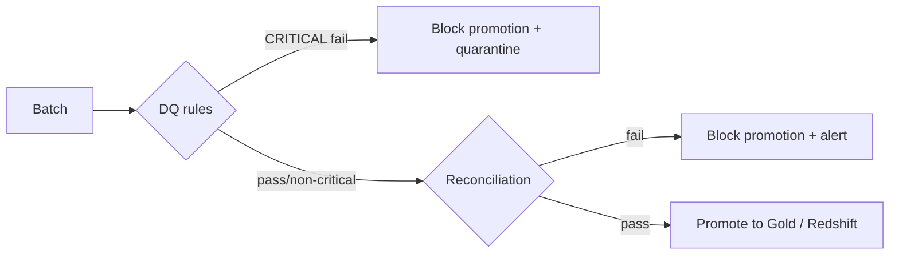

# HLD 04 — Data Quality & Reconciliation

## Two distinct questions

- **Data Quality** asks: *is this record valid?* (Section 11)
- **Reconciliation** asks: *did we move/process the expected data correctly?* (Section 12)

A batch can pass DQ (every row individually well-formed) and still fail
reconciliation (500 rows extracted from source, only 480 landed downstream —
each of those 480 is individually valid, but 20 went missing). Conversely a
batch can pass reconciliation (counts match) while failing DQ (all 500 rows
landed, but 3 have a null required field). Both gates run, independently,
before Gold/Redshift promotion.

## DQ severities and their effect

| Severity | Effect |
|---|---|
| CRITICAL | Blocks promotion entirely; whole batch quarantined; SNS alert |
| ERROR | Only the failing rows are quarantined; the rest promotes |
| WARNING | Logged; batch promotes unchanged |
| INFO | Logged; batch promotes unchanged |

Rule types (`src/data_quality/rules.py::RuleType`): `NOT_NULL, UNIQUE,
DUPLICATE, DATA_TYPE, RANGE, REFERENTIAL_INTEGRITY, REGEX, RECORD_COUNT,
FRESHNESS, BUSINESS_RULE, SCHEMA_MATCH`.

## Reconciliation checks

| Check | Question answered |
|---|---|
| `RECORD_COUNT` | Same number of rows in and out? |
| `AGGREGATE` | Does `SUM`/`AVG`/`COUNT` of a numeric column match? |
| `CONTROL_TOTAL` | Does a finance-relevant total (e.g. PO amount) match? |
| `KEY_RECONCILIATION` | Is the *set* of business keys identical (not just the count)? |
| `PARTITION_DATE` | Does each date partition's count match individually? |

Every check carries a `tolerance_pct` — exact-match for keyed financial data
(orders, purchase orders), a small tolerance for volume metrics like
inventory snapshots where rounding/timing skew is expected and acceptable.

## Quarantine

Rejected records are written to `s3://.../quarantine/{pipeline}/{run_id}/`
with `run_id, pipeline, rule_name, error_reason, source_file,
ingestion_timestamp` attached (`src/data_quality/quarantine.py`). Quarantine
is not a dead end: once the upstream issue is fixed, the same file can be
re-extracted and reprocessed — quarantine preserves enough metadata to know
exactly what was rejected and why.

## Schema evolution (Section 24)

| Change | Classification |
|---|---|
| New nullable/optional column | COMPATIBLE |
| Removed optional column | COMPATIBLE |
| New required column with default | WARNING |
| Type widening (int → decimal/string) | WARNING |
| Unexpected extra column | WARNING |
| Renamed column | BREAKING |
| Type narrowing | BREAKING |
| Removed required column | BREAKING |
| Missing required column | BREAKING |

A BREAKING change halts the affected pipeline immediately (before DQ even
runs against the batch) and alerts — see `src/data_quality/validators.py::classify_schema_change`.

## Reference implementation

- `src/data_quality/framework.py`, `rules.py`, `validators.py`, `quarantine.py`
- `src/reconciliation/framework.py`, `record_count.py`, `aggregate_check.py`, `control_totals.py`
- `config/base/dq_rules.yaml`, `config/base/reconciliation.yaml`, `config/base/schemas.yaml`
- Tests: `tests/data_quality/`, `tests/reconciliation/`, `tests/unit/test_schema_evolution.py`
- LLD: [../lld/05_dq_framework_lld.md](../lld/05_dq_framework_lld.md), [../lld/04_reconciliation_lld.md](../lld/04_reconciliation_lld.md)
