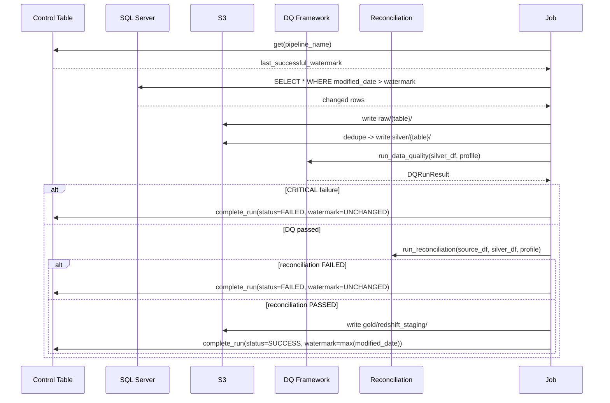

# LLD 01 — SQL Server Watermark Incremental Ingestion

## Objective

Extract only rows changed since the last successful run from SQL Server,
land them in S3, and advance the watermark **only** after the full
downstream pipeline (write → DQ → reconciliation → commit) succeeds
(Section 7).

## Assumptions

- Every incrementally-loaded source table has a reliable, monotonically
  increasing `modified_date`-style column (or equivalent) that is updated
  on every insert/update.
- Deletes are **not** visible via a watermark scan (a deleted row simply
  stops appearing) — tables that need delete visibility use the CDC path
  instead (LLD-02), not plain watermark incrementals.
- Clock skew between the SQL Server host and the extraction environment is
  small enough not to cause missed rows near the extraction boundary; for
  tables sensitive to this, a small overlap window (not implemented in this
  reference version) would be the standard mitigation.

## Input / Output

**Input:** `config/base/sources.yaml` pipeline entry (source table,
watermark column, primary key, DQ/reconciliation profile), plus the current
`control.pipeline_control.last_successful_watermark`.

**Output:** Parquet files in `s3://.../raw/{table}/` and `.../silver/{table}/`,
an updated (or unchanged, on failure) control-table row, and an
`audit.pipeline_run_log` entry.

## Components

| Component | File |
|---|---|
| Source connector | `src/ingestion/sqlserver/extractor.py` |
| Control table | `src/common/audit.py::ControlTableStore` |
| Watermark guard | `src/common/idempotency.py::WatermarkCommitGuard` |
| DQ | `src/data_quality/framework.py` |
| Reconciliation | `src/reconciliation/framework.py` |
| Glue job wrapper | `glue/jobs/ingest_sqlserver.py` |
| Orchestration | `airflow/dags/retail_batch_pipeline.py` |

## Sequence flow



## Table/schema: control table

See `sql/control_tables/ddl_control_table.sql`. Key columns:
`pipeline_name (PK), last_successful_watermark, current_run_id,
last_run_status, records_read, records_written, error_message`.

## Pseudocode

```
previous_watermark = control.get(pipeline).last_successful_watermark
df = extract(table, watermark_column, since=previous_watermark)
guard = WatermarkCommitGuard(pipeline, previous_watermark)
guard.advance(EXTRACTED)

write(df, raw_uri)
silver_df = dedupe(df, primary_key)
write(silver_df, silver_uri)
guard.advance(WRITTEN)

dq_result = run_dq(silver_df, dq_profile)
enforce(dq_result)              # raises DataQualityError on CRITICAL
guard.advance(DQ_PASSED)

recon_result = run_reconciliation(df, silver_df, recon_profile)
enforce(recon_result)           # raises ReconciliationError on FAILED
guard.advance(RECONCILED)

commit(silver_df, staging_uri)
guard.advance(COMMITTED)

new_watermark = max(df[watermark_column])
persisted_watermark = guard.resolved_watermark(new_watermark)  # only advances if COMMITTED
control.complete_run(pipeline, run_id, status, records_read, records_written, persisted_watermark)
```

## Actual code

See `src/ingestion/sqlserver/run_demo.py` for the full working
implementation of the above pseudocode (runnable via `make demo-incremental`)
and `glue/jobs/ingest_sqlserver.py` for the AWS Glue-hosted equivalent.

## Exception handling & retry

- `RetryableError` subclasses (e.g. `SourceUnavailableError`) are retried
  by `src.common.retry.with_retry` with exponential backoff + jitter
  (default: 3 attempts, 30s initial delay) at the extraction step.
- `DataQualityError` and `ReconciliationError` are **not** retried — they
  represent a data problem, not a transient one; the run is marked FAILED
  immediately and alerted.
- Airflow adds a second, outer retry layer (task-level `retries` in
  `retail_batch_pipeline.py`) for cases like a Glue job launch API call
  itself failing transiently.

## Logging & audit

Every stage emits a structured log line
(`src.common.logging_utils.get_logger`) with `pipeline`, `run_id`, `task`,
`records_read/written`. On completion, `audit.pipeline_run_log` gets one
row per run (SUCCESS or FAILED) — see Section 36.

## Security

Source credentials resolved via `SecretsManagerAdapter` (never hardcoded).
Glue execution role scoped to `raw/`, `bronze/`, `silver/`, `gold/`,
`quarantine/` only (`infrastructure/iam/glue-execution-role-policy.json`).

## Performance

- `NumberOfWorkers`/`WorkerType` sized per environment
  (`config/{env}/environment.yaml: glue`).
- Partitioned S3 writes on `order_date` so downstream readers can prune.
- Glue Job Bookmarks are enabled as a secondary optimization (skip
  already-seen S3 source files on reruns) but are **not** the source of
  truth for watermark state — see `glue/scripts/glue_utils.py`'s note and
  ADR-004 for why the control table, not bookmarks, governs correctness.

## Edge cases

| Case | Handling |
|---|---|
| No new rows since watermark | Empty DataFrame; DQ/reconciliation pass trivially; watermark unchanged (nothing to advance it to) |
| Source table temporarily unreachable | `SourceUnavailableError` retried; run FAILED if retries exhausted, watermark unchanged |
| Duplicate rows within one extract window | Deduped by primary key (latest wins) in `bronze_to_silver` |
| Clock skew causes a row to be missed at the boundary | Not solved by this reference implementation — documented limitation; production mitigation is a small overlap + downstream idempotent merge |

## Test cases

`tests/integration/test_source_to_s3.py`,
`tests/integration/test_processing_to_redshift.py`,
`tests/unit/test_idempotency.py`.
