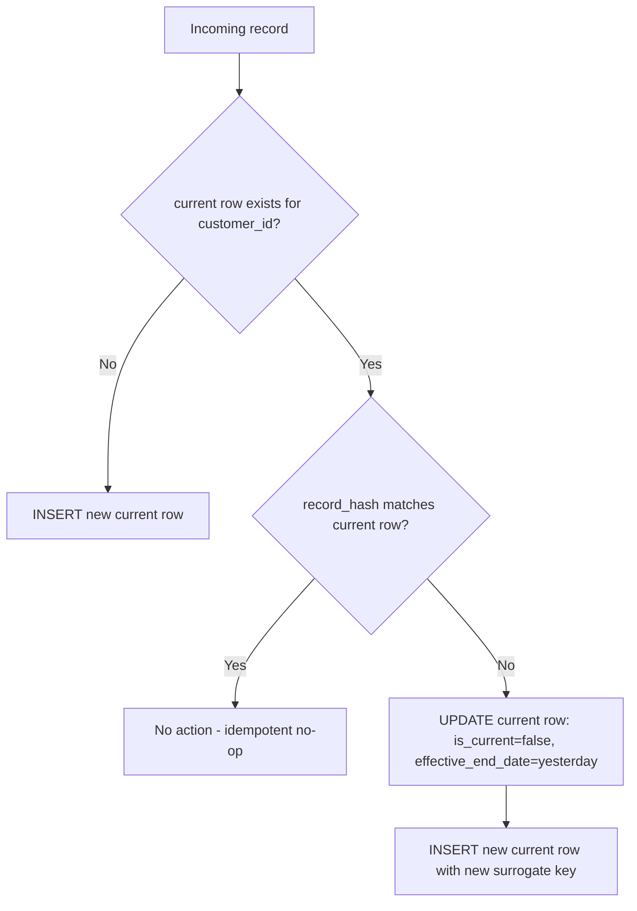

# LLD 03 — SCD Type 2 Customer Dimension

## Objective

Preserve full history of customer attribute changes in `dim_customer` so
fact tables and analytics can answer "what was true about this customer at
the time of this order" — not just "what is true now".

## Assumptions

- `customer_id` (business key) is stable and never reused for a different
  real-world customer.
- Tracked attributes (`customer_name, email, segment, city`) are the only
  ones that trigger a new version; other columns (if added later) would
  need an explicit decision about whether they're tracked or not.
- Input to `apply_scd2` is already CDC-deduplicated (one row per
  `customer_id` per run) — SCD2 does not itself handle duplicate/out-of-order
  events; that's LLD-02's job.

## Input / Output

**Input:** Current `dim_customer` snapshot + a deduplicated batch of
new/changed customer records.

**Output:** Updated `dim_customer` — existing current rows either untouched,
expired, or newly inserted; brand-new customers inserted as current.

## Components

| Component | File |
|---|---|
| Python reference implementation | `src/dimensional_model/scd_type2.py` |
| Redshift SQL equivalent | `sql/dimensions/scd2_merge_dim_customer.sql` |
| Hash helper | `src/common/idempotency.py::record_hash` |

## Table/schema

```
customer_sk (PK, surrogate), customer_id, customer_name, email, segment, city,
effective_start_date, effective_end_date, is_current, record_hash
```

`customer_sk` is a surrogate key generated fresh for every version, so
`fact_sales.customer_sk` can point at "the customer as they were on order
date" via a point-in-time join, not only the latest version.
`customer_id` (business key) is what ties all versions of one real customer
together.

## Sequence flow



## Pseudocode

```
for each incoming record:
    incoming_hash = record_hash(record, TRACKED_ATTRIBUTES)
    current = dim[dim.customer_id == record.customer_id AND dim.is_current]

    if current is empty:
        insert(new_surrogate_key(), record, effective_start=today, is_current=True, hash=incoming_hash)
    elif current.record_hash == incoming_hash:
        pass  # no change -> idempotent no-op
    else:
        update(current, is_current=False, effective_end_date=yesterday)
        insert(new_surrogate_key(), record, effective_start=today, is_current=True, hash=incoming_hash)
```

## Actual code

`src/dimensional_model/scd_type2.py::apply_scd2` implements exactly this,
returning counts (`inserted_new, inserted_changed, expired, unchanged`) for
audit. The Redshift SQL version (`scd2_merge_dim_customer.sql`) performs
the same three-way logic as two set-based statements (an `UPDATE` to expire,
an `INSERT ... SELECT` for both new and changed customers) rather than a
per-row loop, since Redshift is not well suited to row-by-row procedural
logic at scale.

## Why hash comparison

Comparing every tracked attribute individually (`name != OLD.name OR email
!= OLD.email OR ...`) works but grows unwieldy and error-prone as tracked
attributes are added. A single `record_hash` over the tracked-attribute set
means adding a new tracked attribute is a one-line change
(`TRACKED_ATTRIBUTES` list) rather than a change to every comparison
expression across the codebase.

## Exception handling & retry

SCD2 apply itself doesn't raise on bad data — it's a pure transformation.
Bad input (e.g. null `customer_id`) should have already been caught by DQ
before reaching this stage (LLD-05); if it isn't, `apply_scd2` would treat a
null key as its own "customer", which is why DQ's `NOT_NULL` rule on the
business key is CRITICAL, not optional.

## Logging & audit

`apply_scd2`'s return counts are logged and written to the run's audit row;
a spike in `inserted_changed` relative to history can itself be a useful
DQ-adjacent signal (e.g. "did an upstream extract accidentally include a
default/placeholder value that looks like a change to every row?").

## Security

`dim_customer` carries PII (name, email, city). Same encryption-at-rest via
Redshift's cluster-level KMS key; access controlled via Redshift-level
grants, not covered further here (out of this project's IAM-role scope,
which focuses on AWS service roles rather than end-user Redshift grants).

## Performance

- Redshift `DISTKEY(customer_id)` + `SORTKEY(customer_id,
  effective_start_date)` so both the lookup-by-business-key and the
  point-in-time range join are efficient.
- The Python reference implementation is O(n) over the incoming batch with
  a per-row DataFrame filter; acceptable for daily customer-change batch
  sizes, not intended for continuous high-throughput streaming SCD2 (a
  different architecture — e.g. incremental materialized views — would be
  used at that scale).

## Concurrency

Single-writer assumption: `customer_pipeline`'s Airflow DAG sets
`max_active_runs=1` specifically because two concurrent SCD2 merges against
the same `dim_customer` could both read the same "current" row and both
attempt to expire it — a lost-update race. True multi-writer safety would
need either a Redshift-level lock or an optimistic-concurrency version
column; neither is implemented in this reference project (documented
limitation, Section 38's "don't claim more than is implemented").

## Edge cases

| Case | Handling |
|---|---|
| New customer | Inserted as current, no prior history |
| No attribute change | No-op (rerun-safe) |
| Attribute change | Old row expired, new row inserted with new surrogate key |
| Same batch applied twice | Second application is entirely no-ops (idempotent) |
| Late-arriving change (older event arrives after a newer one was already applied) | Not specially handled in this reference version — "latest processed wins", which can differ from "latest business timestamp wins" if events arrive out of order across separate runs; CDC-level dedup within a single run (LLD-02) does handle this correctly *within* one batch |

## Test cases

`tests/unit/test_scd2.py` — new customer, no-change no-op, attribute
change (expire + insert), rerun idempotency, surrogate-key uniqueness
across versions.
