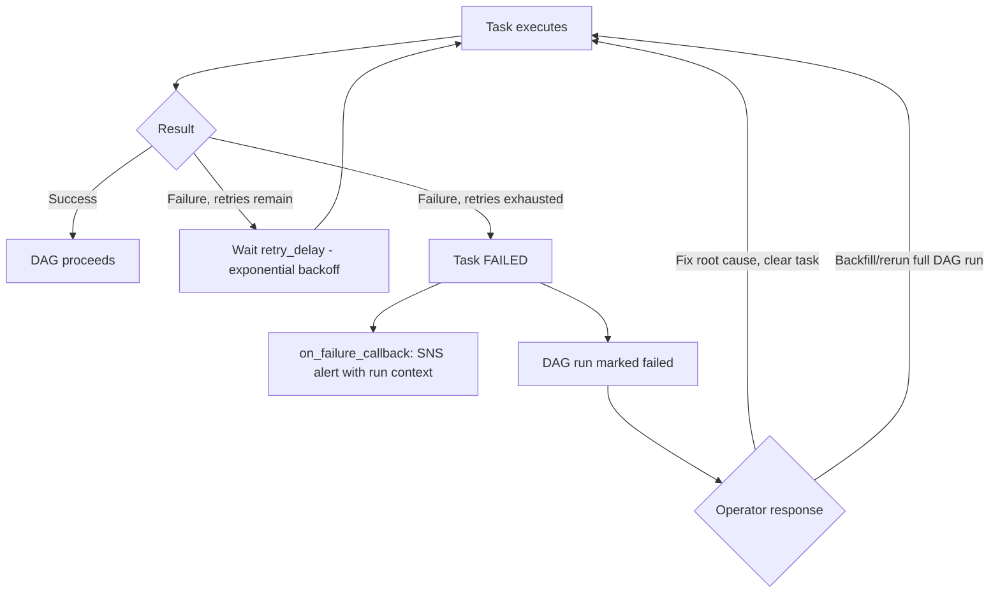

# LLD 07 — Airflow Retry/Restart Pattern

## Objective

Ensure every task in every DAG can be retried — by Airflow automatically,
or manually re-triggered by an operator — without producing a different or
corrupted outcome than a clean single run would have.

## Assumptions

- Every task that writes data does so through a component that is already
  idempotent at the data layer (control table, merge/upsert, SCD2 hash
  comparison) — Airflow's retry mechanism itself does nothing to guarantee
  correctness; it only re-invokes the task, so the *task's* logic must be
  safe to re-invoke.
- Glue/EMR jobs triggered by a task are themselves restartable from their
  own last committed state (they read the control table's
  `last_successful_watermark`, same as a fresh run would).

## Input / Output

**Input:** A failed task instance (any DAG, any task).

**Output:** A re-executed task that either succeeds and continues the DAG,
or fails again (and is retried up to `retries`, then marks the DAG run
failed and alerts).

## Components

- `default_args` per DAG (`retries`, `retry_delay`,
  `retry_exponential_backoff`, `max_retry_delay`) — see any DAG under
  `airflow/dags/`.
- `on_failure_callback` (`retail_batch_pipeline.py::_on_failure_callback`) —
  SNS alert with full task context on every failure, retried or not.
- Underlying idempotent components: `src.common.idempotency`,
  `src.cdc.merge`, `src.dimensional_model.scd_type2`.

## Sequence flow



## Pseudocode: why a task retry is safe

```
# Example: the scd2_merge task in customer_pipeline.py
# Retry #1 of scd2_merge after a transient Redshift connection drop:
scd2_merge(staging_batch)
  -> UPDATE dim_customer SET is_current=false WHERE record_hash <> staging.record_hash
     # if this already ran once (partial failure after UPDATE, before INSERT),
     # rerunning finds those rows ALREADY is_current=false and record_hash already
     # differs from nothing (they're expired) -> WHERE clause naturally excludes them
  -> INSERT ... SELECT WHERE not matched OR record_hash differs
     # already-inserted new-current rows now have record_hash = staging.record_hash
     # -> excluded by the WHERE clause on retry -> no duplicate insert
```

This is the same idempotency property documented in LLD-03/LLD-06, restated
here specifically in terms of "what happens when Airflow retries this exact
task."

## Task design rules applied throughout this repo

1. **No task holds required state only in memory across a retry.** Any
   state a retried task needs (run_id, watermark, counts) is either
   recomputed identically or read from the control/audit table — never
   passed only via a previous (now-discarded) task attempt's local
   variables.
2. **XCom carries small facts, not data.** Tasks push counts/status to
   XCom for cross-task visibility; they never push a DataFrame through
   XCom (Section 13: heavy data never flows through Airflow itself).
3. **`max_active_runs` reflects real concurrency safety**, not just
   throughput preference — `customer_pipeline` sets it to 1 specifically
   because concurrent SCD2 merges aren't safe (LLD-03's concurrency note).

## Exception handling & retry

Airflow-level retry (`retries`/`retry_delay`) is a *second* retry layer on
top of the retry already implemented inside Glue/EMR jobs
(`src.common.retry`). They serve different failure modes: the inner retry
handles a transient error *within* one job execution (e.g. one JDBC call
timing out); the outer Airflow retry handles the job invocation itself
failing (e.g. the `GlueJobOperator`'s API call to start the job failing, or
the job being killed by infrastructure issues outside its own retry loop).

## Logging & audit

Every task failure — retried or terminal — triggers
`on_failure_callback`, which publishes to SNS with `dag_id, task_id,
execution_date, try_number, log_url` so an on-call engineer can jump
straight to the failing attempt's logs.

## Security

No special IAM considerations beyond the MWAA execution role documented in
`infrastructure/iam/README.md`.

## Performance

`EmrStepSensor` uses `mode="reschedule"` (not `poke`) for multi-hour EMR
steps specifically so the sensor doesn't occupy a worker slot for the
entire polling duration — it frees the slot between checks (Section 15/34
resource-efficiency principle applied to orchestration, not just Spark).

## Edge cases

| Case | Handling |
|---|---|
| Task fails after partial side effect (e.g. wrote to S3 but crashed before control-table update) | Rerun re-derives the same S3 output (overwrite, not append) and then successfully updates the control table |
| Operator manually clears and reruns a task from days ago | Safe — the task re-reads current control-table state, not stale in-memory state from the original run |
| Two DAG runs of the same DAG overlap (`max_active_runs` misconfigured) | Explicitly prevented via `max_active_runs=1` on concurrency-sensitive DAGs |
| SLA breach without a task failure (task just running long) | `sla` fires a separate SLA-miss alert; does not fail the task itself |

## Test cases

Airflow DAG logic is not directly unit-tested in this repo (DAGs require
the MWAA runtime — see `airflow/README.md`); the idempotency properties
that make retries safe *are* unit-tested at the component level:
`tests/unit/test_idempotency.py`, `tests/unit/test_merge.py`,
`tests/unit/test_scd2.py`.
