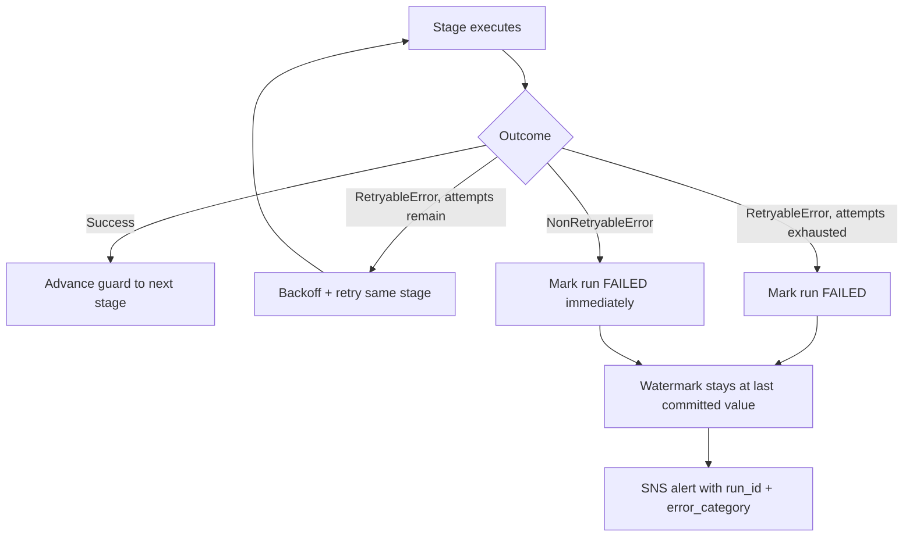

# LLD 10 — Failure Handling & Resilience

## Objective

Give every category of failure (Section 21) a defined detection mechanism,
a retry-or-not decision, a concrete action, an alerting rule, and a
restart point — so "what happens when X breaks" is answered by this
document and the code, not improvised during an incident.

## Assumptions

- Failures are classified as either transient (worth retrying) or
  permanent/business-rule (never retried) — see
  `src/common/exceptions.py`'s `RetryableError`/`NonRetryableError` split.
- Every pipeline's restart point is the control table's
  `last_successful_watermark`, never a mid-pipeline checkpoint file.

## Failure matrix

| Failure | Detection | Retry? | Action | Alert? | Restart point |
|---|---|---|---|---|---|
| Source unavailable | Connection exception at extract | Yes, exponential backoff | Retry up to `retry_count`, then FAIL | Yes, on exhaustion | Last successful watermark |
| API rate limit (HTTP 429) | `ApiRateLimitError` from transport | Yes, backoff respects rate limit | Retry within `max_attempts` | Only if retries exhausted | Same API page/cursor (idempotent pagination) |
| Glue job failure | Non-zero exit / Glue run state FAILED | Yes, Airflow task retry | Airflow retries `GlueJobOperator` task | Yes, `on_failure_callback` | Control table watermark unchanged |
| EMR failure | `EmrStepSensor` detects step FAILED | Limited (2 retries — cluster time is costly) | Retry step; preserve last successful control-table state | Yes | Backfill window unchanged, safe to resubmit |
| Bad data (DQ CRITICAL) | `DataQualityError` raised by `enforce()` | No | Quarantine batch, mark run FAILED | Yes | Watermark unchanged; fix data/rule, rerun |
| Schema breaking change | `classify_schema_change()` returns BREAKING | No | Fail fast before DQ/processing even runs | Yes | Watermark unchanged |
| Partial write | Guard never reaches COMMITTED | No — the eventual commit-or-not decision is deterministic, not retried mid-write | Write goes to staging location; only promoted after DQ+reconciliation | Yes, if terminal | Rerun re-derives the same output (overwrite) |
| Duplicate input (rerun/redelivery) | N/A — prevented by design, not detected after the fact | N/A | Idempotent merge/upsert absorbs it | No | N/A |
| Airflow task failure | Task instance state | Per `default_args.retries` | Airflow's own retry mechanism | Yes, `on_failure_callback` | Task is safe to rerun (LLD-07) |
| Network/transient failure | Connection reset, timeout | Yes | `RetryableError` path | Only on exhaustion | Depends on stage — same as source-unavailable if during extract |
| Permanent failure (e.g. auth revoked) | Non-retryable exception type, or retries exhausted | No | Stop pipeline, alert, preserve audit state | Yes | Watermark unchanged; requires human intervention (e.g. credential rotation) |
| Reconciliation failure | `ReconciliationError` from `enforce()` | No | Block promotion, alert | Yes | Watermark unchanged |

## Sequence flow: the general failure path



## Pseudocode: the guard that makes "preserve state on failure" automatic

```
guard = WatermarkCommitGuard(pipeline, previous_watermark)
try:
    guard.advance(EXTRACTED); ...
    guard.advance(WRITTEN); ...
    guard.advance(DQ_PASSED); ...
    guard.advance(RECONCILED); ...
    guard.advance(COMMITTED)
except (DataQualityError, ReconciliationError, ...):
    status = "FAILED"
finally:
    watermark_to_persist = guard.resolved_watermark(new_watermark)
    # resolved_watermark() returns previous_watermark unless stage == COMMITTED
    control.complete_run(..., new_watermark=watermark_to_persist)
```

No pipeline needs to remember "don't advance the watermark on failure" as a
rule of thumb — it is structurally impossible to advance it without passing
through every gate, because `resolved_watermark()` checks `stage ==
COMMITTED` directly.

## Exception hierarchy reference

See `src/common/exceptions.py`: `RetryableError` (SourceUnavailableError,
ApiRateLimitError) vs. `NonRetryableError` (SchemaValidationError,
DataQualityError, ReconciliationError, ConfigurationError,
WatermarkConflictError, IdempotencyViolationError). This split is the single
source of truth `src.common.retry.with_retry` uses to decide retry
eligibility — a new exception type's retry behavior is determined entirely
by which base class it extends, not by call-site special-casing.

## Logging & audit

Every failure path writes an `audit.pipeline_run_log` row with `status =
FAILED` and a populated `error_message` — failures are never silently
dropped from the audit trail, which is what makes the failure matrix above
verifiable after the fact (query `audit.pipeline_run_log WHERE status =
'FAILED'` and cross-reference `error_message`/`error_category`).

## Security

Alert payloads (SNS messages) include `run_id`, `pipeline`, and error
category, deliberately not raw record contents — an alert about a DQ
failure on customer data should not itself leak customer PII into a
Slack/email/PagerDuty channel.

## Performance

Retry backoff parameters differ by failure domain: SAP (`retry_count: 5`)
tolerates more attempts than SQL Server/API (`retry_count: 3`), reflecting
observed relative flakiness (Section 2A) — see `config/base/sources.yaml`.

## Edge cases

| Case | Handling |
|---|---|
| Failure occurs *during* the watermark-persist write itself | Control table row remains at its prior state (SQLite/RDS transaction boundary); the next run reads a consistent last-known-good watermark either way |
| Alert delivery itself fails (SNS unavailable) | Not specially handled in this reference implementation — documented gap; a production system would add a dead-letter queue or secondary alert channel |
| Same pipeline fails 3 runs in a row for the same root cause | Each run writes its own audit row; nothing currently suppresses repeated alerts — a production system would add alert deduplication/suppression, out of scope here |

## Test cases

`tests/unit/test_idempotency.py` (guard transitions, watermark freeze on
failure), `tests/unit/test_retry.py` (retryable vs. non-retryable
dispatch, backoff bounds), `tests/integration/test_processing_to_redshift.py`
(`test_failed_run_never_advances_watermark`).
